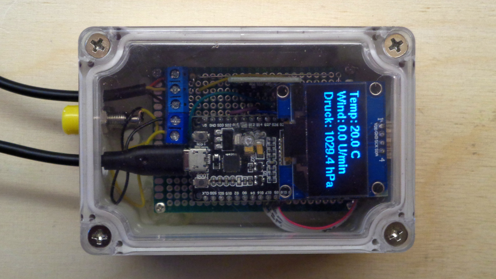
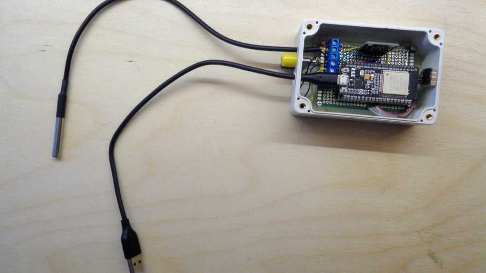

# Wetterstation

Für Geo habe ich eine Wetterstation gebastelt. Diese misst Temperatur und Windgeschwindigkeit, zeigt die Werte auf einem Display an und überträgt sie auch zu ThingSpeak.

## Elektronik

Folgende Komponenten wurden verwendet:

* Mikrocontroller: ESP32 (hier ein TTGO LoRa32 SX1276 OLED Board mit defektem Display)
* Display: 1,3 Zoll OLED 128×64 mit SH1106 Chip
* Temperatursensor: DS18B20 (wasserdicht)
* Neigungssensor: SW-520D (hier als Reedkontakt verwendet)

Auf dem folgenden Foto sieht man den Temperatursensor, den USB-Anschluss und wie es unter dem Display aussieht. An der Seite sind zwei Buchsen, an die das Windrad (siehe unten) angeschlossen wird.

## Messung der Windstärke

Für die Messung der Windstärke habe ich ein Windrad aus Holz gebastelt. Die Schalen für den Wind sind Ü-Ei-Becher. Die Windstärke wird in Umdrehungen pro Minute angezeigt. Um eine Umdrehung zu messen, ist im Halter des Windrads ein Neigungssensor um im Rotor ein Magnet.

Wenn sich der Magnet über dem Neigungssensor bewegt, so löst dieser aus und wenn er sich weiterbewegt dann noch einmal.

## Code

Das Programm habe ich mit der Arduino-IDE erstellt. Es findet sich unter [wetterstation/wetterstation.ino](wetterstation/wetterstation.ino).